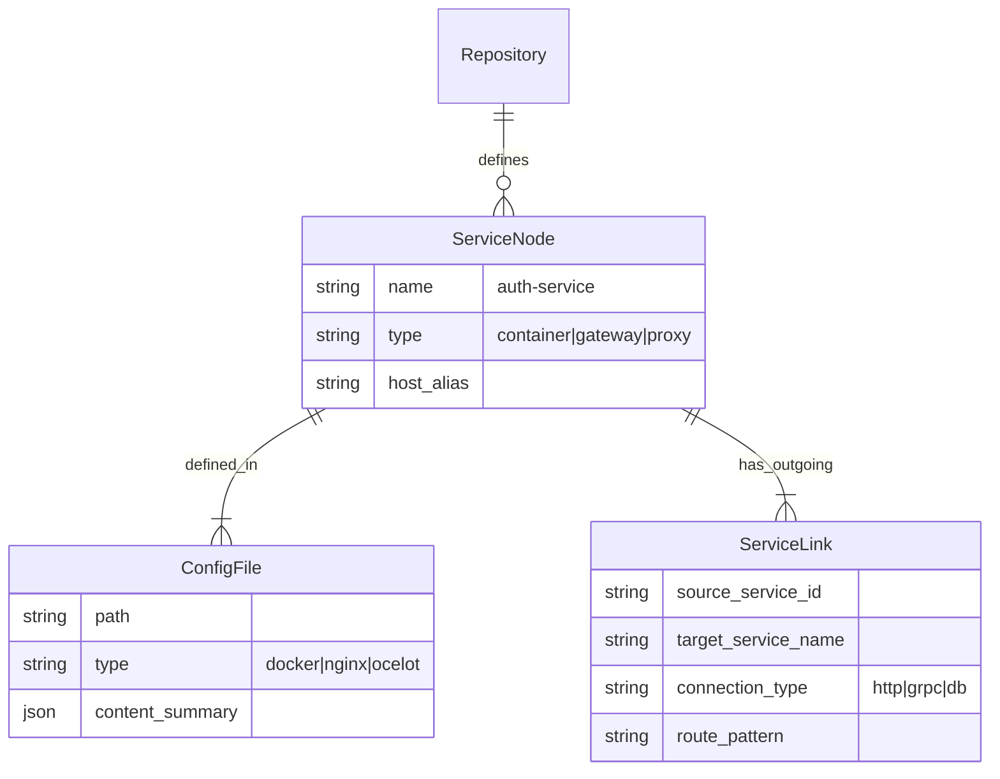

# Infrastructure Analysis Specification

## Goal
Enable the Axon MCP Server to parse infrastructure configuration files (`docker-compose.yml`, `nginx.conf`, `ocelot.json`) within **target repositories** to build a comprehensive "Service Graph". This allows the AI to understand how microservices discover and communicate with each other.

## 1. Supported Configuration Files

### A. Docker Compose (`docker-compose.yml`, `docker-compose.yaml`)
**Purpose**: Defines service containers, exposed ports, and environment variables (often containing connection strings).
**Extraction Targets**:
- **Service Names**: Identify the logical name of the service (e.g., `auth-service`).
- **Environment Variables**: Extract URLs, connection strings, and service aliases (e.g., `USER_SERVICE_URL=http://user-service:8080`).
- **Ports**: Map internal ports to external ports.

### B. Nginx Configuration
**Detection Strategy**:
- **Repository Name**: Contains "nginx" (case-insensitive).
- **File Pattern**: `*.conf` OR `nginx.conf`.
- **Content/Language**: Files identified as "Nginx Configuration" or containing `server {`, `upstream {`, `location /`.

**Purpose**: Acts as a Reverse Proxy or Load Balancer.
**Extraction Targets**:
- **Upstreams**: Identify backend service groups.
- **Locations**: Map URL paths (e.g., `/api/v1/users`) to backend services (`proxy_pass http://user_service`).
- **Rewrite Rules**: Understand how URLs are transformed before reaching the backend.

### C. Ocelot API Gateway
**Detection Strategy**:
- **File Pattern**: `*ocelot*.json` (case-insensitive, e.g., `ocelot.json`, `ocelot.global.json`, `Ocelot.Local.json`).

**Purpose**: .NET-based API Gateway for microservices.
**Extraction Targets**:
- **Routes**: Map `UpstreamPathTemplate` (public API) to `DownstreamPathTemplate` (internal service API).
- **DownstreamHostAndPorts**: Identify the target service host and port.
- **AuthenticationOptions**: Identify which routes require auth.

## 2. Data Model Extensions

To store this knowledge, we will extend the database schema:

## 3. Parsing Strategy

### Docker Compose Parser
- **Library**: `PyYAML`
- **Logic**:
    1. Load YAML.
    2. Iterate `services` keys.
    3. For each service, parse `environment` to find keys ending in `_URL`, `_HOST`, `_CONNECTION`.
    4. Create `ServiceNode` for the service.
    5. Create `ServiceLink` for every detected connection string.

### Nginx Parser
- **Library**: `crossplane` (Python Nginx config parser) or custom regex-based parser.
- **Logic**:
    1. Parse `http` -> `server` -> `location` blocks.
    2. Extract `proxy_pass` directives.
    3. If `proxy_pass` points to an `upstream` block, resolve the upstream servers.
    4. Create `ServiceLink` from `nginx` to the `upstream` target.

### Ocelot Parser
- **Library**: `json` (Standard Lib)
- **Logic**:
    1. Load JSON.
    2. Iterate `Routes` array.
    3. Map `UpstreamPathTemplate` (e.g., `/users/{id}`) to `DownstreamScheme` + `DownstreamHostAndPorts` + `DownstreamPathTemplate`.
    4. Create `ServiceLink` representing the gateway route.

## 4. Integration with "The Linker"

The **Cross-Service Linker** (Phase 3 of Roadmap) will use this data to resolve fuzzy service references.

**Scenario**:
1. **Frontend** calls `fetch('/api/orders')`.
2. **Nginx** config has `location /api/orders { proxy_pass http://order-service:5000; }`.
3. **Docker Compose** defines `order-service` as the container for the `OrderService` repository.
4. **Linker** connects: `Frontend Call` -> `Nginx Route` -> `Docker Service` -> `Backend Repository`.

## 5. User Value
This enables the AI to answer questions like:
- *"Where does the request to `/api/orders` go?"*
- *"Which service handles authentication for the `payment-service`?"*
- *"Generate a diagram of all services that connect to the Redis cache."*
