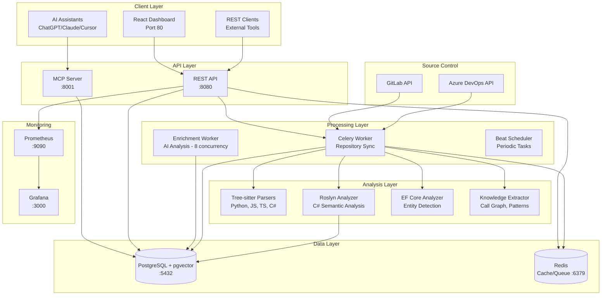
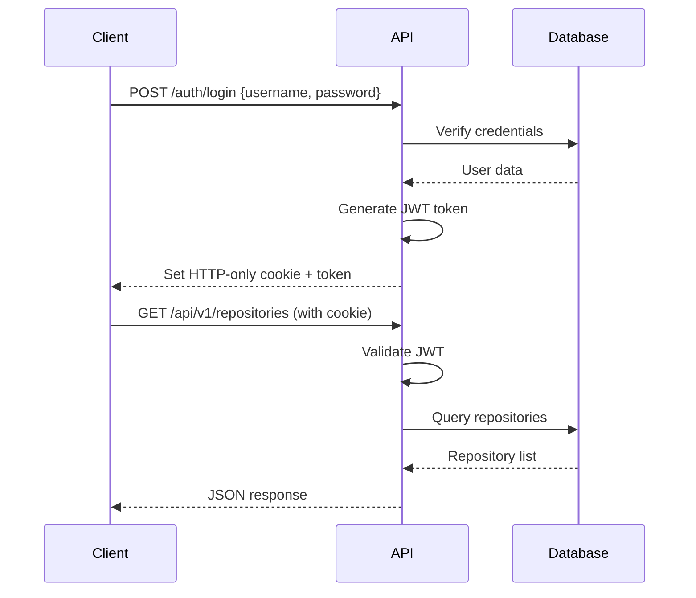
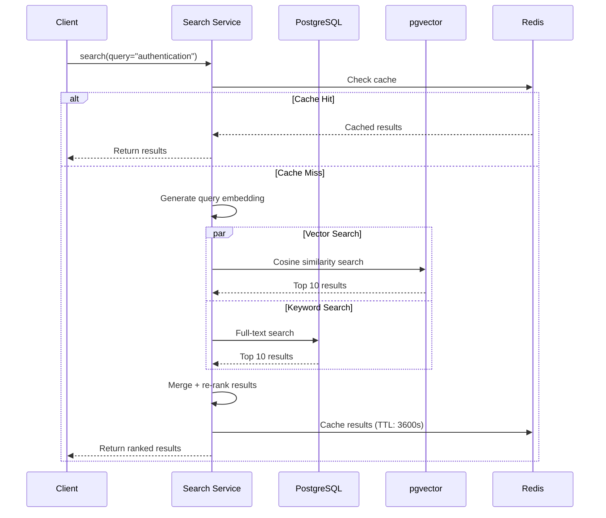
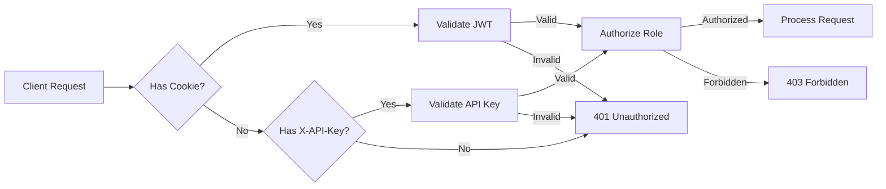

# System Architecture Overview

## 📋 Executive Summary

Axon.MCP.Server is a sophisticated **AI-powered code intelligence platform** built on a modern microservices architecture. It combines **FastAPI** (REST API), **Model Context Protocol** (AI integration), **Celery** (distributed processing), and a **hybrid analysis engine** (Tree-sitter + Roslyn) to transform codebases into queryable knowledge bases.

---

## 🏗️ High-Level Architecture

### System Components Diagram



---

## 🔧 Technology Stack

### Backend Stack
- **Web Framework**: FastAPI 0.110.0 (async, high-performance)
- **Background Processing**: Celery 5.3.6 + Redis
- **Database ORM**: SQLAlchemy 2.0.29 (async)
- **Authentication**: PyJWT 2.10.1, python-jose 3.3.0
- **Code Parsing**:
  - Tree-sitter 0.25.0+ (Python, JS, TS, C#)
  - Roslyn (C# semantic analysis via subprocess)
- **Embeddings**:
  - Local: sentence-transformers 2.5.1+
  - Cloud: OpenAI API 1.14.0
- **LLM Integration**: OpenRouter/Ollama/OpenAI
- **Monitoring**: Prometheus 0.20.0, structlog 24.1.0

### Frontend Stack
- **Framework**: React 18 + TypeScript
- **Build Tool**: Vite 5
- **Styling**: Custom CSS with dark theme
- **State Management**: React hooks + Context API

### Infrastructure
- **Database**: PostgreSQL 15 + pgvector extension
- **Cache/Queue**: Redis 7
- **Container**: Docker + Docker Compose
- **Monitoring**: Prometheus + Grafana
- **Migrations**: Alembic 1.13.1

---

## 📦 Core Components

### 1. API Layer (`src/api`)

**Purpose**: REST API endpoints for UI and external integrations

**Key Files**:
- [main.py](file:///e:/Health/Axon.MCP.Server/src/api/main.py) - FastAPI application entry point
- [auth.py](file:///e:/Health/Axon.MCP.Server/src/api/auth.py) - JWT + API Key authentication
- `routes/` - API endpoint handlers

**Responsibilities**:
- Handle HTTP requests
- JWT authentication and authorization
- Rate limiting (SlowAPI)
- Request validation (Pydantic)
- Response formatting

**Authentication Flow**:


---

### 2. MCP Server (`src/mcp_server`)

**Purpose**: Model Context Protocol server for AI assistant integration

**Key Files**:
- [server.py](file:///e:/Health/Axon.MCP.Server/src/mcp_server/server.py) - MCP protocol implementation
- `tools/` - 12 MCP tools for AI assistants
- `resources/` - MCP resource handlers

**12 Available Tools**:
1. `search` - Semantic + full-text code search
2. `get_symbol_details` - Detailed symbol information
3. `get_call_graph` - Function call relationships
4. `get_inheritance_hierarchy` - Class inheritance tree
5. `get_module_summary` - AI-generated code summaries
6. `get_file_symbols` - List symbols in a file
7. `get_repository_structure` - Project/solution organization
8. `get_api_endpoints` - List REST API routes
9. `get_ef_entities` - Entity Framework mappings
10. `explore_service` - Navigate service architecture
11. `find_implementations` - Interface implementations
12. `get_system_architecture_map` - Architecture diagrams

**Transport Modes**:
- **HTTP** (default): `http://localhost:8001` - For remote AI clients
- **Stdio**: Standard input/output - For local Claude Desktop

---

### 3. Workers (`src/workers`)

**Purpose**: Distributed background processing with Celery

**Key Files**:
- [celery_app.py](file:///e:/Health/Axon.MCP.Server/src/workers/celery_app.py) - Celery configuration
- [sync_worker.py](file:///e:/Health/Axon.MCP.Server/src/workers/sync_worker.py) - Main repository sync orchestrator (605 lines)

**Worker Types**:
- **Core Worker** (1 concurrency): CPU-bound tasks (parsing, cloning)
- **Enrichment Worker** (8 concurrency): IO-bound tasks (LLM calls)
- **Beat Scheduler**: Periodic tasks (auto-sync, cleanup)

**Queues**:
- `repository_sync` - Repository cloning and parsing
- `file_parsing` - Individual file processing
- `embeddings` - Vector embedding generation
- `ai_enrichment` - LLM-based enrichment
- `default` - General tasks

---

### 4. Analysis Layer

#### 4.1 Tree-sitter Parsers (`src/parsers`)

**Purpose**: Fast syntactic parsing for multiple languages

**Supported Languages**:
- C# ([csharp_parser.py](file:///e:/Health/Axon.MCP.Server/src/parsers/csharp_parser.py))
- Python ([python_parser.py](file:///e:/Health/Axon.MCP.Server/src/parsers/python_parser.py))
- JavaScript/TypeScript ([javascript_parser.py](file:///e:/Health/Axon.MCP.Server/src/parsers/javascript_parser.py))
- Vue ([vue_parser.py](file:///e:/Health/Axon.MCP.Server/src/parsers/vue_parser.py))

**Extracts**:
- Symbols (classes, functions, variables)
- Docstrings/comments
- Import statements
- Basic relationships
- Complexity scores (cyclomatic complexity)

#### 4.2 Roslyn Analyzer (`roslyn_analyzer/`)

**Purpose**: Deep semantic analysis for C# code

**Architecture**: Persistent C# subprocess communicating via JSON over stdin/stdout

**Capabilities**:
- Type resolution (`var user` → `User` class)
- Cross-file references
- Namespace resolution
- Generic type inference
- Method signature extraction with full type info

**Communication Protocol**:
```json
// Request
{"operation": "analyze", "filePath": "UserService.cs", "content": "..."}

// Response
{
  "symbols": [...],
  "relations": [
    {"from": "UserController.Login", "to": "AuthService.Authenticate", "type": "calls"}
  ]
}
```

#### 4.3 Knowledge Extractor (`src/extractors`)

**Purpose**: Extract high-level patterns and relationships

**Components**:
- [knowledge_extractor.py](file:///e:/Health/Axon.MCP.Server/src/extractors/knowledge_extractor.py) - Main coordinator
- [api_extractor.py](file:///e:/Health/Axon.MCP.Server/src/extractors/api_extractor.py) - Detect REST endpoints
- [call_graph_builder.py](file:///e:/Health/Axon.MCP.Server/src/extractors/call_graph_builder.py) - Build function call graph
- [pattern_detector.py](file:///e:/Health/Axon.MCP.Server/src/extractors/pattern_detector.py) - Detect design patterns

**Extracts**:
- API endpoints (routes, HTTP methods)
- Call graphs (function dependencies)
- Import relationships
- Design patterns (Repository, Factory, etc.)

#### 4.4 EF Core Analyzer (`src/analyzers`)

**Purpose**: Extract Entity Framework Core mappings

**Extracts**:
- Entity classes → Database tables
- Properties → Columns
- Relationships (one-to-many, many-to-many)
- Foreign keys, navigation properties

---

### 5. Data Layer

#### 5.1 Database (`src/database`)

**Models** ([models.py](file:///e:/Health/Axon.MCP.Server/src/database/models.py)):
- 14 SQLAlchemy models
- Optimized indexes for common queries
- Cascading deletes for data integrity
- pgvector column for embeddings

**Session Management** ([session.py](file:///e:/Health/Axon.MCP.Server/src/database/session.py)):
- Async session factory
- Connection pooling (20 connections, max 40)
- Automatic session cleanup

#### 5.2 Redis Cache

**Uses**:
- Celery message broker
- Search result caching
- LLM response caching
- Real-time sync progress (Pub/Sub)

---

### 6. Embeddings (`src/embeddings`)

**Purpose**: Generate vector embeddings for semantic search

**Components**:
- [generator.py](file:///e:/Health/Axon.MCP.Server/src/embeddings/generator.py) - Embedding generation
- [summarizer.py](file:///e:/Health/Axon.MCP.Server/src/embeddings/summarizer.py) - LLM-based summarization
- [chunking.py](file:///e:/Health/Axon.MCP.Server/src/embeddings/chunking.py) - Code chunking strategies

**Providers**:
- **Local**: sentence-transformers/all-mpnet-base-v2 (768 dims)
- **OpenAI**: text-embedding-3-small (1536 dims)

**Chunking Strategy**:
- Function-level chunks (entire function body)
- Class-level chunks (class definition + methods)
- Module-level chunks (file overview)

---

## ⚙️ Processing Pipeline

The **sync_repository** task orchestrates the complete analysis pipeline:

```mermaid
graph LR
    A[1. Clone<br/>Repository] --> B[2. Detect<br/>Solutions]
    B --> C[3. Restore<br/>.NET Deps]
    C --> D[4. Initialize<br/>Roslyn]
    D --> E[5. Discover<br/>Files]
    E --> F[6. Parse<br/>Tree-sitter]
    F --> G[7. Analyze<br/>Roslyn C#]
    G --> H[8. Extract<br/>APIs]
    H --> I[9. Resolve<br/>Imports]
    I --> J[10. Build<br/>Call Graph]
    J --> K[11. Detect<br/>Services]
    K --> L[12. Analyze<br/>EF Entities]
    L --> M[13. Generate<br/>Embeddings]
    M --> N[14. AI<br/>Enrichment]
```



### Pipeline Steps Detail

1. **Clone Repository**: GitLab/Azure DevOps API → local cache
2. **Detect Solutions/Projects**: Scan `.sln` and `.csproj` files
3. **Restore .NET Dependencies**: Run `dotnet restore`
4. **Initialize Roslyn**: Start C# subprocess, load solution
5. **Discover Files**: List source files, compute hashes
6. **Parse (Tree-sitter)**: Extract symbols, imports, complexity
7. **Analyze (Roslyn)**: Deep C# semantic analysis
8. **Extract APIs**: Detect REST endpoints, routes
9. **Resolve Imports**: Map import statements to symbols
10. **Build Call Graph**: Track function calls
11. **Detect Services**: Identify APIs, workers, libraries
12. **Analyze EF Entities**: Extract database mappings
13. **Generate Embeddings**: Create vector embeddings
14. **AI Enrichment**: LLM-generated summaries (optional)

**Memory Management**:
- Keyset pagination (50 files per batch)
- `session.expunge_all()` every 50 files
- Re-fetch repository context per batch

---

## 🐳 Deployment Architecture

### Docker Services (10 Containers)

```
┌─────────────────────────────────────────────────────────────┐
│                    Docker Network: axon-network             │
├─────────────────────────────────────────────────────────────┤
│                                                             │
│  ┌──────────────┐  ┌──────────────┐  ┌──────────────┐     │
│  │ PostgreSQL   │  │    Redis     │  │   React UI   │     │
│  │  + pgvector  │  │   Cache/MQ   │  │   (Nginx)    │     │
│  │    :5432     │  │    :6379     │  │     :80      │     │
│  └──────────────┘  └──────────────┘  └──────────────┘     │
│                                                             │
│  ┌──────────────┐  ┌──────────────┐                        │
│  │  REST API    │  │  MCP Server  │                        │
│  │  (FastAPI)   │  │    (HTTP)    │                        │
│  │    :8080     │  │    :8001     │                        │
│  └──────────────┘  └──────────────┘                        │
│                                                             │
│  ┌──────────────┐  ┌──────────────┐  ┌──────────────┐     │
│  │   Worker     │  │  Enrichment  │  │     Beat     │     │
│  │ (Sync - 1)   │  │ Worker (8)   │  │  Scheduler   │     │
│  └──────────────┘  └──────────────┘  └──────────────┘     │
│                                                             │
│  ┌──────────────┐  ┌──────────────┐                        │
│  │  Prometheus  │  │   Grafana    │                        │
│  │    :9090     │  │    :3000     │                        │
│  └──────────────┘  └──────────────┘                        │
│                                                             │
└─────────────────────────────────────────────────────────────┘
```

**Resource Allocation**:
- **Core Worker**: 1 concurrency (CPU-bound parsing)
- **Enrichment Worker**: 8 concurrency (IO-bound LLM calls)
- **PostgreSQL**: 20 connection pool, max 40
- **Redis**: 50 max connections

---

## 🔍 Search Architecture

### Hybrid Search Flow



### Search Strategies

1. **Semantic Search**: Vector similarity using pgvector
   - Embed query using same model as code chunks
   - Cosine similarity: `embedding <=> query_vector`
   - Fast with HNSW index

2. **Full-Text Search**: PostgreSQL `tsvector`
   - Indexes symbol names, docstrings, signatures
   - Supports fuzzy matching
   - Language-specific stemming

3. **Hybrid**: Combine both with score fusion
   - Vector search weight: 0.6
   - Keyword search weight: 0.4
   - Re-rank by relevance

---

## 🔐 Security Architecture

### Authentication Flow



**Auth Mechanisms**:
- **JWT Tokens**: For UI authentication (HTTP-only cookies)
- **API Keys**: For service-to-service calls
- **Role-Based Access**: admin, readonly

**Secure Defaults**:
- HTTPS enforced in production
- CORS configured for allowed origins
- Rate limiting (100 req/min per IP)
- Audit logging for all API calls

---

## 📊 Monitoring & Observability

### Metrics Stack

```
Application Metrics → Prometheus → Grafana Dashboards
Logs (structlog) → Redis Pub/Sub → Dashboard
Celery Events → Flower (optional)
```

**Key Metrics**:
- API latency (p50, p95, p99)
- Search queries per second
- Repository sync duration
- Worker queue depth
- Database connection pool usage
- Cache hit ratio

**Pre-configured Dashboards**:
- API Performance
- Repository Sync Status
- Search Analytics
- System Health

---

## 🌐 Source Control Integration

### GitLab Integration

**Features**:
- Auto-discover all accessible projects
- Webhook support for auto-sync on push
- Personal Access Token (PAT) authentication

### Azure DevOps Integration

**Features**:
- Repository scanning per project
- NTLM authentication support
- SSL verification bypass (for on-prem)

**API Endpoints**:
- `POST /api/v1/repositories/discover` - Scan source control
- `POST /api/v1/repositories/sync/{id}` - Trigger manual sync
- `GET /api/v1/repositories` - List all repositories

---

## 🔮 Future Architecture Enhancements

### Planned Improvements

1. **RAG Pipeline**: Add `ask_codebase` tool for conversational queries
2. **Microservices Split**: Separate parsing, embeddings, and API into independent services
3. **Kubernetes**: Production-grade orchestration with Helm charts
4. **Event Sourcing**: Audit trail for all symbol changes
5. **GraphQL API**: Supplement REST API for flexible queries
6. **Multi-tenancy**: Organization-level isolation

---

## 📖 Additional Resources

- [Data Models](data_models.md) - Database schema details
- [Infrastructure](infrastructure.md) - Deployment configurations
- [API Reference](../api/rest_api.md) - REST API documentation
- [MCP Tools](../api/mcp_tools.md) - MCP protocol tools
