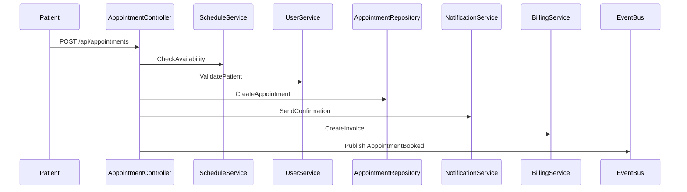

# Hierarchical Documentation Enhancement - Implementation Plan

**Project:** Axon.MCP.Server - Service-Centric Documentation Layer  
**Date:** December 1, 2025  
**Status:** Proposed Enhancement  
**Timeline:** 6-8 Weeks  
**Effort:** 1 Senior Engineer

---

## Executive Summary

This plan outlines the implementation of a hierarchical documentation system that complements the existing code indexing infrastructure. The enhancement adds service-level documentation and business flow mapping to improve AI understanding without changing the core architecture.

**Key Principle:** Additive enhancement - all existing functionality remains unchanged.

---

## Goals & Success Criteria

### Primary Goals
1. **Service Documentation**: Auto-generate documentation for each service/bounded context
2. **Business Flow Mapping**: Document common workflows across services
3. **Hierarchical Navigation**: Enable top-down exploration (Domain → System → Service → Code)
4. **Improved AI Understanding**: Reduce time for architectural queries from 2-5 minutes to 30 seconds

### Success Criteria
- ✅ 100% of detected services have generated documentation
- ✅ All critical business flows are documented
- ✅ Service dependency graph is complete and accurate
- ✅ AI query response time <30 seconds for architectural questions
- ✅ Existing code search functionality unaffected
- ✅ Zero breaking changes to current API/MCP tools

---

## Phase 1: Service Boundary Detection (Week 1-2)

### Objective
Automatically detect service boundaries within repositories based on code structure.

### Tasks

#### 1.1 Create Service Boundary Analyzer
**File:** `src/analyzers/service_boundary_analyzer.py`

```python
class ServiceBoundaryAnalyzer:
    """Detects service boundaries using multiple heuristics"""
    
    def detect_services(self, repository: Repository) -> List[Service]:
        """
        Detect services using:
        - Namespace patterns (e.g., Axon.*.Service)
        - Project structure (.csproj files)
        - Directory naming conventions
        - API endpoint grouping
        """
        
    def extract_service_metadata(self, service: Service) -> ServiceMetadata:
        """
        Extract:
        - Service name
        - Root namespace
        - Primary language
        - Entry points (controllers, endpoints)
        - Configuration files
        """
```

**Detection Strategies:**
1. **C# Services**: Detect by namespace patterns (`*.Service`, `*.API`, `*.Domain`)
2. **Node.js Services**: Detect by `package.json` + directory structure
3. **Python Services**: Detect by module structure + `__init__.py`
4. **Bounded Contexts**: Group related namespaces/modules

**Deliverables:**
- [ ] `ServiceBoundaryAnalyzer` class implemented
- [ ] Unit tests for detection logic (90%+ accuracy)
- [ ] Integration test with real Axon repositories
- [ ] Service detection report (JSON output)

**Estimated Time:** 3-4 days

---

#### 1.2 Create Service Model
**File:** `src/database/models.py` (extend existing)

```python
class Service(Base):
    """Represents a detected service/bounded context"""
    __tablename__ = "services"
    
    id = Column(Integer, primary_key=True)
    repository_id = Column(Integer, ForeignKey("repositories.id"))
    name = Column(String, nullable=False)  # e.g., "AppointmentService"
    namespace = Column(String)  # Root namespace
    service_type = Column(Enum(ServiceType))  # API, Domain, Worker, etc.
    description = Column(Text)  # Auto-generated description
    
    # Metadata
    entry_points = Column(JSON)  # Controllers, endpoints
    dependencies = Column(JSON)  # Other services it depends on
    api_endpoints = Column(JSON)  # Exposed endpoints
    events_published = Column(JSON)  # Event types published
    events_subscribed = Column(JSON)  # Event types consumed
    
    # Documentation
    documentation_path = Column(String)  # Path to generated doc
    last_documented_at = Column(DateTime)
    
    # Relationships
    repository = relationship("Repository", back_populates="services")
    symbols = relationship("Symbol", back_populates="service")
```

**Deliverables:**
- [ ] Database migration for `services` table
- [ ] SQLAlchemy model implementation
- [ ] Alembic migration script

**Estimated Time:** 1 day

---

#### 1.3 Integrate with Knowledge Extractor
**File:** `src/extractors/knowledge_extractor.py` (modify existing)

```python
class KnowledgeExtractor:
    def __init__(self):
        self.service_analyzer = ServiceBoundaryAnalyzer()
    
    async def extract_repository_knowledge(self, repo: Repository):
        # Existing code...
        
        # NEW: Detect and store services
        services = await self.service_analyzer.detect_services(repo)
        for service in services:
            await self._store_service(service)
            
        # Link symbols to services
        await self._link_symbols_to_services(repo, services)
```

**Deliverables:**
- [ ] Service detection integrated into sync workflow
- [ ] Symbols linked to parent services
- [ ] Service detection runs on repository sync

**Estimated Time:** 2 days

---

#### 1.4 Service Dependency Extractor
**File:** `src/analyzers/service_dependency_analyzer.py`

```python
class ServiceDependencyAnalyzer:
    """Analyzes dependencies between services"""
    
    def extract_dependencies(self, service: Service) -> ServiceDependencies:
        """
        Extract:
        - API calls to other services (using existing OutgoingApiCall data)
        - Event publications/subscriptions
        - Database dependencies
        - External service dependencies
        """
        
    def build_dependency_graph(self, repository: Repository) -> DependencyGraph:
        """Build complete service dependency graph"""
```

**Deliverables:**
- [ ] Dependency extraction logic
- [ ] Service dependency graph generation
- [ ] Visualization data (for mermaid diagrams)

**Estimated Time:** 2-3 days

---

### Phase 1 Deliverables Summary
- ✅ Service boundary detection working
- ✅ Services stored in database
- ✅ Symbols linked to services
- ✅ Service dependencies mapped
- ✅ 90%+ detection accuracy on test repositories

**Total Time:** 8-10 days

---

## Phase 2: Service Documentation Generation (Week 3-4)

### Objective
Auto-generate comprehensive service documentation using extracted code data.

### Tasks

#### 2.1 Service Documentation Generator
**File:** `src/generators/service_doc_generator.py`

```python
class ServiceDocGenerator:
    """Generates markdown documentation for services"""
    
    def generate_service_doc(self, service: Service) -> str:
        """
        Generate documentation with:
        1. Service Overview
        2. Responsibility & Key Concepts
        3. Main Business Flows
        4. Dependencies (consumes/publishes)
        5. API Endpoints
        6. Important Components
        7. Business Rules & Constraints
        """
        
    def _extract_responsibility(self, service: Service) -> str:
        """Use LLM to generate responsibility description"""
        
    def _extract_key_concepts(self, service: Service) -> List[str]:
        """Extract domain entities and value objects"""
        
    def _extract_business_flows(self, service: Service) -> List[BusinessFlow]:
        """Identify main workflows from API endpoints"""
        
    def _extract_api_endpoints(self, service: Service) -> List[Endpoint]:
        """List all exposed endpoints"""
```

**Documentation Template:**
```markdown
# {ServiceName}

## 1. Responsibility
{AI-generated description of what this service does}

## 2. Key Concepts
- {Entity1}: {Description}
- {Entity2}: {Description}

## 3. Main Business Flows
### {FlowName}
{Step-by-step description}

## 4. Dependencies
### Consumes
- {ServiceName}: {Purpose}

### Publishes Events
- {EventName}: {Description}

## 5. API Endpoints
- `{Method} {Path}`: {Description}

## 6. Important Components
- `{ClassName}`: {Purpose}

## 7. Business Rules & Constraints
- {Rule1}
- {Rule2}

## 8. Related Documentation
- [API Specification](link)
- [Domain Models](link)
```

**Deliverables:**
- [ ] `ServiceDocGenerator` class
- [ ] LLM integration for description generation
- [ ] Template-based documentation
- [ ] Generated docs stored in `/docs/20-Services/`

**Estimated Time:** 4-5 days

---

#### 2.2 Hierarchical Documentation Structure
**Files:** Create documentation hierarchy

```
/docs
  ├── 00-Overview.md                    # Business domains
  ├── 10-Systems/                       # Solutions
  │   ├── 10-AxonBackendCore.md
  │   ├── 11-AxonDrugDelivery.md
  │   └── 12-AxonAdminPanel.md
  ├── 20-Services/                      # Services (AUTO-GENERATED)
  │   ├── 20-AppointmentService.md
  │   ├── 21-UserService.md
  │   └── 22-AuthService.md
  ├── 30-Modules/                       # Layers
  │   └── (optional, future)
  └── 40-Flows/                         # Business flows
      └── (generated in Phase 3)
```

**Generator Tasks:**
- [ ] Create directory structure
- [ ] Generate Level 0 (Overview) - manual template
- [ ] Generate Level 1 (Systems) - auto from repositories
- [ ] Generate Level 2 (Services) - auto from detected services

**Estimated Time:** 2 days

---

#### 2.3 Business Flow Extractor
**File:** `src/analyzers/business_flow_analyzer.py`

```python
class BusinessFlowAnalyzer:
    """Extracts business flows from code"""
    
    def extract_flows(self, service: Service) -> List[BusinessFlow]:
        """
        Extract flows by:
        - Analyzing API endpoint implementations
        - Tracing method calls from controllers
        - Identifying transaction boundaries
        - Detecting event publications
        """
        
    def generate_flow_description(self, flow: BusinessFlow) -> str:
        """Generate step-by-step flow description"""
        
    def generate_sequence_diagram(self, flow: BusinessFlow) -> str:
        """Generate mermaid sequence diagram"""
```

**Example Flow:**
```markdown
### BookAppointment Flow
1. Patient selects doctor and desired time
2. System checks slot availability (→ ScheduleService)
3. Validates patient eligibility (→ UserService)
4. Creates appointment record (→ Database)
5. Sends confirmation notification (→ NotificationService)
6. Creates billing invoice (→ BillingService)
7. Publishes `AppointmentBooked` event


```

**Deliverables:**
- [ ] Flow extraction logic
- [ ] Sequence diagram generation
- [ ] Flow documentation integrated into service docs

**Estimated Time:** 3-4 days

---

### Phase 2 Deliverables Summary
- ✅ Service documentation auto-generated
- ✅ Hierarchical doc structure created
- ✅ Business flows documented
- ✅ Sequence diagrams generated
- ✅ Documentation stored in repository

**Total Time:** 9-11 days

---

## Phase 3: Enhanced MCP Tools (Week 5-6)

### Objective
Add new MCP tools for hierarchical navigation while keeping existing tools unchanged.

### Tasks

#### 3.1 New MCP Tools
**File:** `src/mcp_server/server.py` (extend existing)

```python
@mcp.tool()
async def get_architecture_overview() -> str:
    """
    Get Level 0 business domain overview
    
    Returns:
        Markdown document with business domains and systems
    """
    
@mcp.tool()
async def list_systems(repository_id: Optional[int] = None) -> List[System]:
    """
    Get Level 1 systems/solutions
    
    Returns:
        List of systems with their purposes and contained services
    """
    
@mcp.tool()
async def get_service_documentation(
    service_name: str,
    repository_id: Optional[int] = None
) -> str:
    """
    Get Level 2 service documentation
    
    Args:
        service_name: Name of service (e.g., "AppointmentService")
        repository_id: Optional repository filter
        
    Returns:
        Complete service documentation markdown
    """
    
@mcp.tool()
async def list_services(
    repository_id: Optional[int] = None,
    service_type: Optional[str] = None
) -> List[ServiceSummary]:
    """
    List all detected services
    
    Returns:
        List of services with names, types, and descriptions
    """
    
@mcp.tool()
async def get_service_dependencies(
    service_name: str,
    direction: str = "both"  # "upstream", "downstream", "both"
) -> ServiceDependencyGraph:
    """
    Get service dependency graph
    
    Returns:
        Graph showing what service depends on and who depends on it
    """
    
@mcp.tool()
async def trace_business_flow(
    endpoint: str,
    repository_id: Optional[int] = None
) -> BusinessFlowTrace:
    """
    Trace complete business flow from endpoint
    
    Args:
        endpoint: API endpoint (e.g., "POST /api/appointments")
        
    Returns:
        Flow description, sequence diagram, involved services
    """
```

**Deliverables:**
- [ ] 6 new MCP tools implemented
- [ ] Tools integrated with existing MCP server
- [ ] Documentation updated
- [ ] Tests for each tool

**Estimated Time:** 4-5 days

---

#### 3.2 Service Search Enhancement
**File:** `src/api/services/search_service.py` (extend existing)

```python
class SearchService:
    # Existing methods...
    
    async def search_services(
        self,
        query: str,
        repository_id: Optional[int] = None
    ) -> List[Service]:
        """Search services by name or description"""
        
    async def search_flows(
        self,
        query: str,
        service_name: Optional[str] = None
    ) -> List[BusinessFlow]:
        """Search business flows"""
```

**Deliverables:**
- [ ] Service search functionality
- [ ] Flow search functionality
- [ ] Integrated with existing search

**Estimated Time:** 2 days

---

#### 3.3 Documentation API Endpoints
**File:** `src/api/routes/documentation.py` (new)

```python
@router.get("/api/v1/documentation/overview")
async def get_overview():
    """Get architecture overview"""
    
@router.get("/api/v1/documentation/systems")
async def list_systems():
    """List all systems"""
    
@router.get("/api/v1/documentation/services")
async def list_services():
    """List all services"""
    
@router.get("/api/v1/documentation/services/{service_name}")
async def get_service_doc(service_name: str):
    """Get service documentation"""
    
@router.get("/api/v1/documentation/services/{service_name}/dependencies")
async def get_service_dependencies(service_name: str):
    """Get service dependency graph"""
    
@router.get("/api/v1/documentation/flows/{endpoint}")
async def trace_flow(endpoint: str):
    """Trace business flow"""
```

**Deliverables:**
- [ ] REST API endpoints for documentation
- [ ] OpenAPI spec updated
- [ ] API tests

**Estimated Time:** 2-3 days

---

### Phase 3 Deliverables Summary
- ✅ 6 new MCP tools available
- ✅ Service search functionality
- ✅ REST API endpoints for documentation
- ✅ All existing tools unchanged

**Total Time:** 8-10 days

---

## Phase 4: Integration & Testing (Week 7)

### Objective
Integrate all components and validate with real repositories.

### Tasks

#### 4.1 Integration Testing
**Tests:** `tests/integration/test_hierarchical_docs.py`

```python
async def test_end_to_end_service_documentation():
    """Test complete flow: sync → detect → document → query"""
    
async def test_service_boundary_detection():
    """Validate service detection accuracy"""
    
async def test_documentation_generation():
    """Validate generated documentation quality"""
    
async def test_mcp_tools():
    """Test all new MCP tools"""
    
async def test_backward_compatibility():
    """Ensure existing functionality unchanged"""
```

**Test Repositories:**
- Axon.Backend.Core
- Axon.DrugDelivery.Service
- Axon.Admin.Panel

**Deliverables:**
- [ ] Integration tests (95%+ coverage)
- [ ] Performance benchmarks
- [ ] Accuracy validation (manual review)

**Estimated Time:** 3-4 days

---

#### 4.2 Documentation Quality Validation
**Manual Review Checklist:**
- [ ] Service responsibilities are accurate
- [ ] Business flows are complete
- [ ] Dependencies are correct
- [ ] API endpoints are listed
- [ ] Sequence diagrams are valid

**AI Testing:**
- [ ] Query: "How does appointment booking work?" → Returns service doc + flow
- [ ] Query: "What services does UserService depend on?" → Returns dependency graph
- [ ] Query: "List all services in Axon.Backend.Core" → Returns service list

**Deliverables:**
- [ ] Quality validation report
- [ ] AI query test results
- [ ] Accuracy metrics

**Estimated Time:** 2 days

---

#### 4.3 Performance Optimization
**Optimization Tasks:**
- [ ] Cache generated documentation
- [ ] Index services for fast search
- [ ] Optimize dependency graph queries
- [ ] Add pagination for large result sets

**Performance Targets:**
- Service documentation retrieval: <100ms
- Dependency graph generation: <500ms
- Flow tracing: <1s

**Deliverables:**
- [ ] Performance benchmarks met
- [ ] Caching implemented
- [ ] Query optimization

**Estimated Time:** 2 days

---

### Phase 4 Deliverables Summary
- ✅ All integration tests passing
- ✅ Documentation quality validated
- ✅ Performance targets met
- ✅ Backward compatibility confirmed

**Total Time:** 7 days

---

## Phase 5: Documentation & Rollout (Week 8)

### Objective
Document the new features and prepare for production deployment.

### Tasks

#### 5.1 User Documentation
**Files to Create/Update:**
- [ ] `docs/guides/hierarchical-navigation.md` - User guide for new features
- [ ] `docs/api/mcp_tools.md` - Update with new tools
- [ ] `docs/architecture/service-documentation.md` - Technical documentation
- [ ] `README.md` - Update with new capabilities

**Content:**
- How to use new MCP tools
- How service detection works
- How to customize documentation templates
- Examples and use cases

**Estimated Time:** 2 days

---

#### 5.2 Migration Guide
**File:** `docs/guides/migration-to-hierarchical-docs.md`

```markdown
# Migration Guide: Hierarchical Documentation

## What's New
- Service boundary detection
- Auto-generated service documentation
- Business flow tracing
- New MCP tools

## What's Unchanged
- All existing MCP tools
- Code search functionality
- Symbol indexing
- API endpoints (except new /documentation routes)

## How to Enable
1. Run repository sync (automatic detection)
2. Generate documentation: `make generate-docs`
3. Use new MCP tools

## Rollback Plan
- Feature can be disabled via config flag
- No database schema changes that affect existing features
```

**Estimated Time:** 1 day

---

#### 5.3 Configuration
**File:** `.env.example` (update)

```bash
# Hierarchical Documentation (Optional Enhancement)
ENABLE_SERVICE_DOCUMENTATION=true
SERVICE_DOC_AUTO_GENERATE=true
SERVICE_DOC_OUTPUT_DIR=./docs/20-Services
SERVICE_DETECTION_MIN_CONFIDENCE=0.7
```

**Deliverables:**
- [ ] Configuration options documented
- [ ] Feature flags implemented
- [ ] Default settings defined

**Estimated Time:** 1 day

---

#### 5.4 Deployment
**Deployment Steps:**
1. Run database migrations
2. Sync existing repositories (triggers service detection)
3. Generate documentation for all services
4. Verify MCP tools working
5. Monitor performance

**Rollout Strategy:**
- Deploy to staging first
- Test with 2-3 repositories
- Collect feedback
- Deploy to production

**Deliverables:**
- [ ] Deployment checklist
- [ ] Rollback procedure
- [ ] Monitoring alerts configured

**Estimated Time:** 1-2 days

---

### Phase 5 Deliverables Summary
- ✅ User documentation complete
- ✅ Migration guide available
- ✅ Configuration documented
- ✅ Deployment successful

**Total Time:** 5-6 days

---

## Timeline Summary

| Phase | Duration | Key Deliverables |
|-------|----------|------------------|
| **Phase 1: Service Detection** | 8-10 days | Service boundary detection, dependency mapping |
| **Phase 2: Documentation Generation** | 9-11 days | Auto-generated service docs, business flows |
| **Phase 3: MCP Tools** | 8-10 days | 6 new MCP tools, REST API endpoints |
| **Phase 4: Integration & Testing** | 7 days | Tests, validation, optimization |
| **Phase 5: Documentation & Rollout** | 5-6 days | User docs, deployment |
| **Total** | **37-44 days** | **Complete hierarchical documentation system** |

**Recommended Timeline:** 6-8 weeks (with buffer for iterations)

---

## Resource Requirements

### Personnel
- **1 Senior Backend Engineer** (full-time, 6-8 weeks)
  - Python expertise
  - LLM integration experience
  - Database design knowledge

### Infrastructure
- No additional infrastructure required
- Uses existing PostgreSQL, Redis, LLM APIs

### Budget
- **Development:** Included in engineering time
- **LLM API Costs:** +$50-100/month for documentation generation
- **Testing:** Use existing test infrastructure

---

## Risks & Mitigation

| Risk | Impact | Probability | Mitigation |
|------|--------|-------------|------------|
| **Service detection accuracy <90%** | Medium | Medium | Manual review + iterative improvement |
| **LLM-generated docs inaccurate** | Medium | Low | Template-based fallback, human review |
| **Performance degradation** | High | Low | Caching, async processing, monitoring |
| **Breaking existing functionality** | High | Very Low | Comprehensive tests, feature flags |
| **Low adoption by AI/developers** | Medium | Medium | Clear documentation, examples, training |

---

## Success Metrics

### Quantitative Metrics
- **Service Detection Accuracy:** >90%
- **Documentation Coverage:** 100% of detected services
- **AI Query Speed:** <30 seconds for architectural questions
- **API Response Time:** <500ms for documentation endpoints
- **Test Coverage:** >95%

### Qualitative Metrics
- AI can answer "How does X work?" without reading code
- Developers find service docs helpful for onboarding
- Service dependency graph is accurate and useful
- No complaints about broken existing functionality

---

## Post-Implementation

### Maintenance
- **Weekly:** Review auto-generated docs for accuracy
- **Monthly:** Update documentation templates based on feedback
- **Quarterly:** Improve service detection algorithms

### Future Enhancements (Optional)
- Level 3: Module/layer documentation
- Level 4: Critical component documentation
- Custom documentation templates per service type
- Real-time documentation updates on code changes
- Integration with architecture decision records (ADRs)

---

## Conclusion

This implementation plan provides a clear path to adding hierarchical documentation to Axon.MCP.Server while maintaining the stability and performance of the existing system.

**Key Principles:**
- ✅ Additive enhancement (no breaking changes)
- ✅ Incremental rollout (can deploy phase by phase)
- ✅ Measurable success criteria
- ✅ Clear rollback plan

**Expected Outcome:**
A more intelligent AI assistant that understands your architecture at the service level, making it faster and more accurate for architectural questions while preserving all existing code search capabilities.

---

**Next Steps:**
1. Review and approve this plan
2. Allocate engineering resources
3. Begin Phase 1: Service Boundary Detection
4. Iterate based on feedback

**Questions or Concerns:** Contact development team for clarification.
